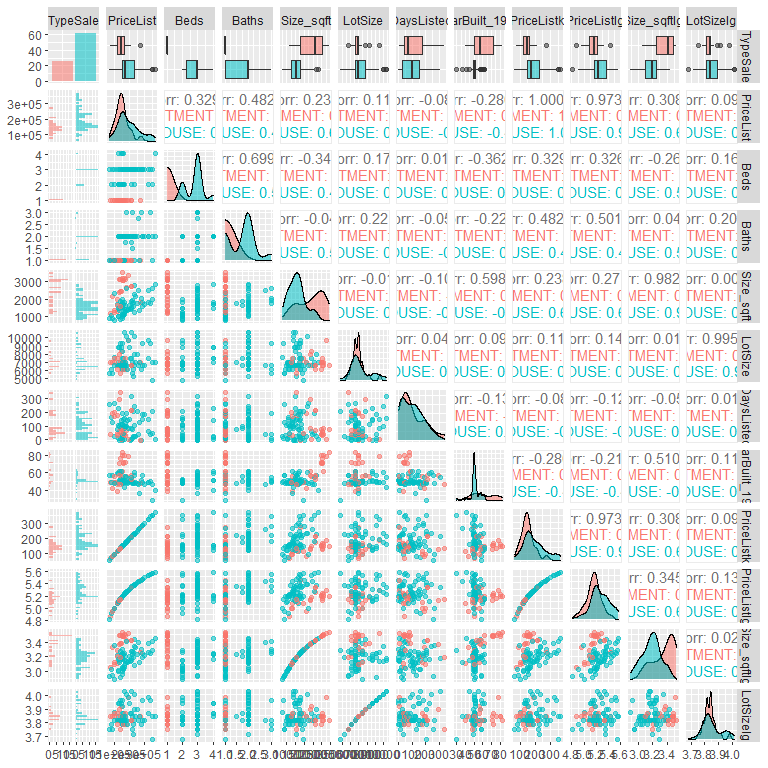

Albuquerque Home Prices
================
Alejandro Aragon
11/22/2021

# Background:

A dataset of listing prices for dwellings (homes and apartments) for
sale from
[Zillow.com](http://www.zillow.com/homes/for_sale/Albuquerque-NM-87108/95303_rid/any_days/35.095087-106.52167835.035021-106.633258_rect/13_zm/0_mmm/)
on Feb 26, 2016 at 1 PM for Albuquerque NM 87108 was composed by
Professor Erik Erhardt in the University of New Mexico Statistics
Department.

# Objective:

Develop a model to help understand which qualities that contribute to a
**typical dwellings’ listing price**. Also, predict the listing prices
of new listings.

``` r
datFull <- read.csv(datapath, skip=2, stringsAsFactors = FALSE)[,-1]
str(datFull)
```

    ## 'data.frame':    143 obs. of  8 variables:
    ##  $ TypeSale  : chr  "HOUSE" "APARTMENT" "APARTMENT" "CONDO" ...
    ##  $ PriceList : int  186900 305000 244000 108000 64900 275000 133000 75000 149900 207000 ...
    ##  $ Beds      : int  3 1 1 3 2 3 2 2 3 3 ...
    ##  $ Baths     : num  2 1 1 2 1 3 1 2 2 2 ...
    ##  $ Size_sqft : int  1305 2523 2816 1137 1000 2022 1440 1207 1573 1394 ...
    ##  $ LotSize   : num  6969 6098 6098 NA NA ...
    ##  $ YearBuilt : int  1954 1948 1989 1996 1985 1952 1952 1965 1958 1952 ...
    ##  $ DaysListed: int  0 0 0 0 1 1 1 1 1 2 ...

``` r
summary(datFull)
```

    ##    TypeSale           PriceList            Beds           Baths      
    ##  Length:143         Min.   :  55000   Min.   :1.000   Min.   :1.000  
    ##  Class :character   1st Qu.: 130000   1st Qu.:1.000   1st Qu.:1.000  
    ##  Mode  :character   Median : 165000   Median :3.000   Median :1.000  
    ##                     Mean   : 216716   Mean   :2.308   Mean   :1.585  
    ##                     3rd Qu.: 234950   3rd Qu.:3.000   3rd Qu.:2.000  
    ##                     Max.   :3110000   Max.   :5.000   Max.   :6.000  
    ##                                                       NA's   :1      
    ##    Size_sqft        LotSize         YearBuilt      DaysListed    
    ##  Min.   :  610   Min.   :  3049   Min.   :1930   Min.   :   0.0  
    ##  1st Qu.: 1238   1st Qu.:  6534   1st Qu.:1950   1st Qu.:  30.5  
    ##  Median : 1700   Median :  6969   Median :1953   Median :  86.0  
    ##  Mean   : 2194   Mean   : 13270   Mean   :1958   Mean   : 119.8  
    ##  3rd Qu.: 2446   3rd Qu.:  8712   3rd Qu.:1962   3rd Qu.: 168.5  
    ##  Max.   :33000   Max.   :609840   Max.   :2006   Max.   :1867.0  
    ##                  NA's   :23       NA's   :4

# Data Cleaning and Wrangling

## Notes for Possible Corrections *Prior to Modeling* (added over the course of this section):

-   `TypeSale` variable type needs to be changed from character to
    factor.
-   NA’s exist in dataset. After the dataset of typical dwellings is
    made, omitting vs imputing missing data will be considered on the
    dataset size.
    -   A missing `Baths` value may disqualify an observation as a
        dwelling but a missing `YearBuilt` might be best addressed via
        imputation.
-   Few condos, for sale by owner, and foreclosures, are represented in
    the data.
-   Clear visual outliers in `PriceList`, `Size_sqft`, `LotSize`,
    `DaysListed`
    -   Dwellings (2 identified) with 6 to 5 baths may not be considered
        “typical”
-   `YearBuilt` might benefit visually from recentering.
-   Clear right skewing of multiple predictor variables possible
    transformations necessary.
-   An apartment building looks like it is being sold and is not a
    representative of a typical dwelling.
-   A house is listed to have the largest lot size in the dataset which
    is unusual considering there are apartments listed here as well.
-   An apartment has been on the market for over 5 years, this could be
    that the building hasn’t been sold or inacurate record keeping.
-   As mentioned above 5 bathrooms is unusual, also the listing price
    for that observation is approximately $400,000 more than the median.
-   An odd number of apartments have more square footage than houses, a
    cap here could help normalize.
-   Transformations of predictor and response variables.
-   Recentering of `PriceList` (by 1000).

## Restrict data to “typical” dwellings

``` r
datFull$TypeSale <- factor(datFull$TypeSale)
summary(datFull)
```

    ##               TypeSale    PriceList            Beds           Baths      
    ##  APARTMENT        :41   Min.   :  55000   Min.   :1.000   Min.   :1.000  
    ##  CONDO            : 5   1st Qu.: 130000   1st Qu.:1.000   1st Qu.:1.000  
    ##  FOR SALE BY OWNER: 1   Median : 165000   Median :3.000   Median :1.000  
    ##  FORECLOSURE      : 5   Mean   : 216716   Mean   :2.308   Mean   :1.585  
    ##  HOUSE            :91   3rd Qu.: 234950   3rd Qu.:3.000   3rd Qu.:2.000  
    ##                         Max.   :3110000   Max.   :5.000   Max.   :6.000  
    ##                                                           NA's   :1      
    ##    Size_sqft        LotSize         YearBuilt      DaysListed    
    ##  Min.   :  610   Min.   :  3049   Min.   :1930   Min.   :   0.0  
    ##  1st Qu.: 1238   1st Qu.:  6534   1st Qu.:1950   1st Qu.:  30.5  
    ##  Median : 1700   Median :  6969   Median :1953   Median :  86.0  
    ##  Mean   : 2194   Mean   : 13270   Mean   :1958   Mean   : 119.8  
    ##  3rd Qu.: 2446   3rd Qu.:  8712   3rd Qu.:1962   3rd Qu.: 168.5  
    ##  Max.   :33000   Max.   :609840   Max.   :2006   Max.   :1867.0  
    ##                  NA's   :23       NA's   :4

**Step 1:**

Plotting the data to get a picture of and establish a “typical
dwelling”.

``` r
library(GGally)
library(ggplot2)
p <- ggpairs(datFull
            , lower = list(continuous = "points")
            , upper = list(continuous = "cor")
            )
print(p)
```

<!-- -->

``` r
# Scaling year built has no impact on data and is purely for aesthetic reasons
datFull$YearBuilt_1900 <- datFull$YearBuilt - 1900
datFull$YearBuilt <- NULL
```

``` r
# Targetting specific outlying observations for further inspection.
datFull[which(datFull$PriceList>1000000), ]
```

    ##      TypeSale PriceList Beds Baths Size_sqft LotSize DaysListed YearBuilt_1900
    ## 120 APARTMENT   3110000    1     1     33000   56628        201             60

``` r
datFull[which(datFull$LotSize>200000), ]
```

    ##    TypeSale PriceList Beds Baths Size_sqft LotSize DaysListed YearBuilt_1900
    ## 31    HOUSE    175000    3     3      2314  609840         22             60

``` r
datFull[which(datFull$DaysListed>750), ]
```

    ##      TypeSale PriceList Beds Baths Size_sqft LotSize DaysListed YearBuilt_1900
    ## 143 APARTMENT    145000    1     1      2332    6534       1867             78

``` r
datFull[which(datFull$Baths>4), ]
```

    ##        TypeSale PriceList Beds Baths Size_sqft LotSize DaysListed
    ## 18  FORECLOSURE     91200    4     6      2350    6534          8
    ## 130       HOUSE    650000    5     5      5573   13068        234
    ##     YearBuilt_1900
    ## 18              72
    ## 130             50

``` r
# Assigning a working dataset.
datWork <- datFull
```

``` r
datWork <- datFull
datWork <- datWork[-which(datWork$LotSize>12000), ]
datWork <- datWork[-which(datWork$DaysListed>365), ]
datWork <- datWork[-which(datWork$Baths>4), ]
```

``` r
datWork <- datWork[-which(datWork$TypeSale == "CONDO")  ,]
datWork <- datWork[-which(datWork$TypeSale == "FOR SALE BY OWNER")  ,]
datWork <- datWork[-which(datWork$TypeSale == "FORECLOSURE")  ,]
datWork$TypeSale <- factor(datWork$TypeSale)
```

``` r
summary(datWork)
```

    ##       TypeSale    PriceList           Beds          Baths         Size_sqft   
    ##  APARTMENT:32   Min.   : 65000   Min.   :1.00   Min.   :1.000   Min.   : 783  
    ##  HOUSE    :83   1st Qu.:137000   1st Qu.:1.00   1st Qu.:1.000   1st Qu.:1275  
    ##                 Median :164950   Median :3.00   Median :1.000   Median :1700  
    ##                 Mean   :186742   Mean   :2.33   Mean   :1.524   Mean   :1828  
    ##                 3rd Qu.:225000   3rd Qu.:3.00   3rd Qu.:2.000   3rd Qu.:2360  
    ##                 Max.   :450000   Max.   :5.00   Max.   :3.000   Max.   :3687  
    ##                                                 NA's   :1                     
    ##     LotSize        DaysListed     YearBuilt_1900  
    ##  Min.   : 3049   Min.   :  0.00   Min.   : 30.00  
    ##  1st Qu.: 6534   1st Qu.: 29.50   1st Qu.: 50.00  
    ##  Median : 6969   Median : 83.00   Median : 52.00  
    ##  Mean   : 7139   Mean   : 96.01   Mean   : 55.89  
    ##  3rd Qu.: 7405   3rd Qu.:148.00   3rd Qu.: 59.25  
    ##  Max.   :10454   Max.   :341.00   Max.   :106.00  
    ##  NA's   :18                       NA's   :3

**Visually reassessing the data**

``` r
library(GGally)
library(ggplot2)
p <- ggpairs(datWork
            , mapping = ggplot2::aes(colour = TypeSale, alpha = 0.5)
            , lower = list(continuous = "points")
            , upper = list(continuous = "cor")
            )
print(p)
```

<!-- -->

**Response Centering**

``` r
# Price in units of $1000
datWork$PriceListk <- datWork$PriceList / 1000
```

## Changes Made Because of Diagnostic Plots (Diagnostic Plot Analysis Section)

**Influential Observations**

Change will be made in susequent section for diagnostic plot
demostration.

**Response Transformation**

``` r
datWork$PriceListlg <- log10(datWork$PriceList)
```

**Predictor Transformation**

``` r
datWork$Size_sqftlg <- log10(datWork$Size_sqft)
```

``` r
datWork$LotSizelg <- log10(datWork$LotSize)
```

**YearBuilt Distribution**

Note that this change will change the look of the original diagnostic
plots.

``` r
datWork <- datWork[-which(datWork$YearBuilt_1900>=100), ]
```

# Subset data for model building and prediction

Creating a subset of the data for building the model, and another subset
for prediction later on.

``` r
# remove observations with NAs
datWork <- na.omit(datWork)

# the data subset we will use to build our model
dat.sub <- subset(datWork, DaysListed > 0)

# the data subset we will predict from our model
dat.pred <- subset(datWork, DaysListed == 0)
```

``` r
# the prices we hope to predict well from our model
dat.pred$PriceListlg_true <- dat.pred$PriceListlg
# set them to NA to predict them later
dat.pred$PriceListlg <- NA
```

# Modeling

## Initial (Full) Model

A two-way interaction model will be fit to the full dataset without
transformations

``` r
lm.full <- lm(PriceListk ~ (TypeSale + Beds + Size_sqft + DaysListed + YearBuilt_1900 + LotSize)^2, data = dat.sub)
#lm.full <- lm(PriceList ~ (Beds + Baths + Size.sqftlg + LotSizelg + DaysListed + YearBuilt_1900)^2, data = dat.abq.sv)
library(car)
try(Anova(lm.full, type=3))
```

    ## Error in Anova.III.lm(mod, error, singular.ok = singular.ok, ...) : 
    ##   there are aliased coefficients in the model

``` r
## Note that this doesn't work because APARTMENTs only have 1 bed and 1 bath.
## There isn't a second level of bed or bath to estimate the interaction.
## Therefore, remove those two terms
lm.full <- update(lm.full, . ~ . - TypeSale:Beds - TypeSale:Baths)
library(car)
try(Anova(lm.full, type=3))
```

    ## Anova Table (Type III tests)
    ## 
    ## Response: PriceListk
    ##                           Sum Sq Df F value   Pr(>F)   
    ## (Intercept)                18329  1  8.1031 0.005815 **
    ## TypeSale                    1631  1  0.7208 0.398806   
    ## Beds                        4090  1  1.8081 0.183135   
    ## Size_sqft                   1019  1  0.4504 0.504395   
    ## DaysListed                  2040  1  0.9021 0.345543   
    ## YearBuilt_1900              1771  1  0.7828 0.379373   
    ## LotSize                     8725  1  3.8571 0.053565 . 
    ## TypeSale:Size_sqft           119  1  0.0525 0.819381   
    ## TypeSale:DaysListed          304  1  0.1343 0.715088   
    ## TypeSale:YearBuilt_1900    15457  1  6.8333 0.010977 * 
    ## TypeSale:LotSize           15118  1  6.6836 0.011847 * 
    ## Beds:Size_sqft               543  1  0.2401 0.625716   
    ## Beds:DaysListed              628  1  0.2774 0.600075   
    ## Beds:YearBuilt_1900        13711  1  6.0616 0.016318 * 
    ## Beds:LotSize                7640  1  3.3777 0.070390 . 
    ## Size_sqft:DaysListed        1788  1  0.7903 0.377107   
    ## Size_sqft:YearBuilt_1900    1953  1  0.8635 0.355990   
    ## Size_sqft:LotSize           9249  1  4.0887 0.047050 * 
    ## DaysListed:YearBuilt_1900    646  1  0.2858 0.594649   
    ## DaysListed:LotSize          2463  1  1.0889 0.300351   
    ## YearBuilt_1900:LotSize       203  1  0.0897 0.765511   
    ## Residuals                 156077 69                    
    ## ---
    ## Signif. codes:  0 '***' 0.001 '**' 0.01 '*' 0.05 '.' 0.1 ' ' 1

## Residual Analysis and Diagnostic Plots

``` r
lm.diag.plots <- function(fit, rc.mfrow=NA, which.plot=c(1,4,6), sw.order.of.data = FALSE) {
  ## lm.diag.plots() is a general function for plotting residual diagnostics for an lm() object
  ## Arguments:
  # fit          linear model object returned by lm()
  # rc.mfrow     number of rows and columns for the graphic plot, e.g., c(2,3)
  # which.plot   default plot numbers for lm()
  # outliers     number to identify in plots from lm() and qqPlot()
  # sw.order.of.data T/F for whether to show residuals by order of data

  # variable names
  var.names <- names(fit$model)[-1]
  # display settings
  if (is.na(rc.mfrow[1])) {
    rc.mfrow <- c(ceiling((length(var.names) + 3 + length(which.plot) + sw.order.of.data) / 3), 3)
  }
  op <- par(no.readonly = TRUE) # the whole list of settable par
  par(mfrow = rc.mfrow)

  # default: Fitted, Cook's distance (with cutoff), and Leverage (with cutoffs)
  for(i.plot in which.plot) {
    plot(fit, which = i.plot)
    if (i.plot == 4) {
      Di.large <- 4 / (dim(fit$model)[1] - dim(fit$model)[2] - 1)
      abline(h = Di.large, col = "blue", lty = 3)  # horizontal line
    }
    if (i.plot == 6) {
      lev.large <- c(2, 3) * dim(fit$model)[2] / dim(fit$model)[1]
      abline(v = lev.large[1], col = "blue", lty = 3)  # horizontal line
      abline(v = lev.large[2], col = "blue", lty = 2)  # horizontal line
    }
  }

  # Evaluate homoscedasticity
  library(car)
  # non-constant error variance test
  print(ncvTest(fit))
  # plot studentized residuals vs. fitted values
  try(spreadLevelPlot(fit, sub = "(Homoscedasticity)"))

  # Evaluate Collinearity
  library(car)
  vif.val <- vif(fit) # variance inflation factors
  dotchart(vif.val, main = "Collinearity", xlab = "Variance Inflation Factor (VIF)", sub = "Not as useful with interactions")
  abline(v = 2^2, col = "blue", lty = 2)  # vertical line

  # Normal quantile plot (QQ-plot)
  library(car)
  qqPlot(fit$residuals, las = 1, main="QQ Plot", ylab = "Residuals")

  # Box-Cox transformation suggestion
  # only if all values are positive
  if(min(fit$model[,1] > 0)){
    library(car)
    boxCox(lm.full, lambda = seq(-3,3,length=101), main = "Box-Cox power transformation")
  }

  # residuals vs order of data
  if(sw.order.of.data) {
    # order of data (not always interesting)
    plot(fit$residuals, main="Residuals vs Order of data", ylab = "Residuals")
    abline(h = 0, col = "gray75", lty = 3)  # horizontal line at zero
  }

  # residuals plotted vs each main effect
  for(i.plot in 1:length(var.names)) {
    m.lab <- paste("Residuals vs.", var.names[i.plot])
    plot(fit$model[,var.names[i.plot]], fit$residuals, main=m.lab, ylab = "Residuals", xlab = var.names[i.plot])
    abline(h = 0, col = "gray75", lty = 3)  # horizontal line at zero
  }

  par(op) # reset plotting options

  ## Useful list of diags: http://www.statmethods.net/stats/rdiagnostics.html
} # end of reg.diag.plots()
```

``` r
lm.diag.plots(lm.full, rc.mfrow = c(2,3))
```

    FALSE Non-constant Variance Score Test 
    FALSE Variance formula: ~ fitted.values 
    FALSE Chisquare = 0.02787496, Df = 1, p = 0.8674

<!-- --><!-- --><!-- -->

### Diagnostic Plot Analyses

-   Residual vs Fitted is not ideally random and spreadout
-   Observation 32 has a high Cook’s Distance and Leverage
-   Observation 19 has a moderately high leverage
-   The QQ plot shows there is not a perfect normal distribution but
    there is not an obvious “S” shape
-   Box-Cox plot with 0 in the interval shows a transformation of the
    response is necessary
-   `YearBuilt_1900` has a definite cone shape.

These problems will be addressed in the **Data Cleaning and Wrangling**
section.

## Second Model (After Changes)

Linear model after transformations noted above

``` r
## Remove influential observations
## Observations 45 and 137 added after second model
dat.sub <- dat.sub[-which(row.names(dat.sub) %in% c(32, 19, 45, 137)),]
```

``` r
lm.trans.dat <- lm(PriceListlg ~ (TypeSale + Beds + Size_sqftlg + DaysListed + YearBuilt_1900 + LotSizelg)^2, data = dat.sub)
#lm.full <- lm(PriceList ~ (Beds + Baths + Size.sqftlg + LotSizelg + DaysListed + YearBuilt_1900)^2, data = dat.abq.sv)
library(car)
try(Anova(lm.trans.dat, type=3))
```

    ## Error in Anova.III.lm(mod, error, singular.ok = singular.ok, ...) : 
    ##   there are aliased coefficients in the model

``` r
lm.trans.dat <- update(lm.trans.dat, . ~ . - TypeSale:Beds - TypeSale:Baths)
library(car)
try(Anova(lm.trans.dat, type=3))
```

    ## Anova Table (Type III tests)
    ## 
    ## Response: PriceListlg
    ##                             Sum Sq Df F value  Pr(>F)  
    ## (Intercept)                0.01533  1  1.3227 0.25427  
    ## TypeSale                   0.03577  1  3.0864 0.08359 .
    ## Beds                       0.01134  1  0.9789 0.32608  
    ## Size_sqftlg                0.00068  1  0.0584 0.80985  
    ## DaysListed                 0.01067  1  0.9205 0.34085  
    ## YearBuilt_1900             0.03457  1  2.9827 0.08883 .
    ## LotSizelg                  0.01517  1  1.3087 0.25676  
    ## TypeSale:Size_sqftlg       0.02128  1  1.8363 0.18000  
    ## TypeSale:DaysListed        0.00008  1  0.0072 0.93253  
    ## TypeSale:YearBuilt_1900    0.00001  1  0.0012 0.97234  
    ## TypeSale:LotSizelg         0.01716  1  1.4808 0.22798  
    ## Beds:Size_sqftlg           0.03307  1  2.8536 0.09589 .
    ## Beds:DaysListed            0.00010  1  0.0083 0.92771  
    ## Beds:YearBuilt_1900        0.00745  1  0.6425 0.42568  
    ## Beds:LotSizelg             0.00006  1  0.0054 0.94145  
    ## Size_sqftlg:DaysListed     0.00142  1  0.1226 0.72733  
    ## Size_sqftlg:YearBuilt_1900 0.00228  1  0.1969 0.65867  
    ## Size_sqftlg:LotSizelg      0.00224  1  0.1935 0.66148  
    ## DaysListed:YearBuilt_1900  0.01610  1  1.3896 0.24270  
    ## DaysListed:LotSizelg       0.00865  1  0.7467 0.39064  
    ## YearBuilt_1900:LotSizelg   0.05196  1  4.4833 0.03800 *
    ## Residuals                  0.76489 66                  
    ## ---
    ## Signif. codes:  0 '***' 0.001 '**' 0.01 '*' 0.05 '.' 0.1 ' ' 1

``` r
lm.diag.plots(lm.trans.dat, rc.mfrow = c(2,3))
```

    FALSE Non-constant Variance Score Test 
    FALSE Variance formula: ~ fitted.values 
    FALSE Chisquare = 0.09994103, Df = 1, p = 0.7519

<!-- --><!-- --><!-- -->

Scatterplot of the model-building subset.

``` r
library(GGally)
library(ggplot2)
p <- ggpairs(dat.sub
            , mapping = ggplot2::aes(colour = TypeSale, alpha = 0.5)
            , lower = list(continuous = "points")
            , upper = list(continuous = "cor")
            )
print(p)
```

<!-- -->

## Model Selection (Check Model Assumptions)

Using `step(..., direction="both")` with the BIC criterion, perform
model selection.

``` r
lm.red.BIC <- step(lm.trans.dat, direction="both", test="F", trace = 0
                         , k=log(nrow(dat.sub)))
lm.final <- lm.red.BIC

lm.diag.plots(lm.final, rc.mfrow = c(2,3))
```

    FALSE Non-constant Variance Score Test 
    FALSE Variance formula: ~ fitted.values 
    FALSE Chisquare = 1.840347, Df = 1, p = 0.17491

<!-- --><!-- -->

Model assumptions appear to be reasonably met.

**Final Model**

``` r
summary(lm.final)
```

    ## 
    ## Call:
    ## lm(formula = PriceListlg ~ TypeSale + Size_sqftlg + YearBuilt_1900 + 
    ##     TypeSale:YearBuilt_1900, data = dat.sub)
    ## 
    ## Residuals:
    ##      Min       1Q   Median       3Q      Max 
    ## -0.41375 -0.06065  0.00322  0.05319  0.31661 
    ## 
    ## Coefficients:
    ##                               Estimate Std. Error t value Pr(>|t|)    
    ## (Intercept)                   2.912891   0.292601   9.955 9.15e-16 ***
    ## TypeSaleHOUSE                 0.591045   0.180331   3.278  0.00154 ** 
    ## Size_sqftlg                   0.732315   0.097375   7.521 6.17e-11 ***
    ## YearBuilt_1900               -0.003584   0.001952  -1.836  0.06995 .  
    ## TypeSaleHOUSE:YearBuilt_1900 -0.007651   0.003358  -2.279  0.02529 *  
    ## ---
    ## Signif. codes:  0 '***' 0.001 '**' 0.01 '*' 0.05 '.' 0.1 ' ' 1
    ## 
    ## Residual standard error: 0.1086 on 82 degrees of freedom
    ## Multiple R-squared:  0.5481, Adjusted R-squared:  0.526 
    ## F-statistic: 24.86 on 4 and 82 DF,  p-value: 1.695e-13

### Interpretation of Model Coeffcients

The intercept means that the “starting price” to purchase a dwelling is
812.83 (10^2.91). If the this is a house being sold this listing price
increases to $3162.28 (10^(2.91 + .59)). For every unit increase in
square footage the listing price increases by $5.37. Oddly for every
unit increase in year built the price *decreases* by $1.01 (10 ^
.003584)

## Plot Final Model

<!-- -->

# Prediction

``` r
# predict new observations, convert to data frame
lm.pred <- as.data.frame(predict(lm.final, newdata = dat.pred, interval = "prediction"))
# add column of actual list prices
lm.pred$PriceListlg <- dat.pred$PriceListlg_true


10^lm.pred
```

    ##        fit       lwr      upr PriceListlg
    ## 1 150950.2  91258.21 249686.6      186900
    ## 2 170652.7 101224.44 287700.7      305000
    ## 3 131854.5  75365.74 230683.2      244000

``` r
# attributes of the three predicted observations
dat.pred
```

    ##    TypeSale PriceList Beds Baths Size_sqft LotSize DaysListed YearBuilt_1900
    ## 1     HOUSE    186900    3     2      1305    6969          0             54
    ## 2 APARTMENT    305000    1     1      2523    6098          0             48
    ## 3 APARTMENT    244000    1     1      2816    6098          0             89
    ##   PriceListk PriceListlg Size_sqftlg LotSizelg PriceListlg_true
    ## 1      186.9          NA    3.115611  3.843170         5.271609
    ## 2      305.0          NA    3.401917  3.785187         5.484300
    ## 3      244.0          NA    3.449633  3.785187         5.387390

With the three observations held out to predict against only one fell
within the prediction interval.

# Conclusion

This model isn’t expected to predict the price of a dwelling very well,
because the final model Adjusted *R*<sup>2</sup> accounts for only 53%
of the variability in the data. The poor predictive power of the model
is also shown by the prediction interval being so wide. Problems with
this model stems from the lack of observations and not enough
observations in other `SaleType` factor levels which could’ve given more
insight in the relation of the listing price. Since this is “real world”
data the lack of predictive power and low *R*<sup>2</sup> is not
surprising as data could always be better when not controlled in a lab
setting. What could possibly be looked into is the ability to categorize
housing and apartments, the very slight grouping between the two can be
seen in the Log Listing Price plot, but this would not be a very helpful
model unless for some reason the dwelling type is not listed in the
dataset.
